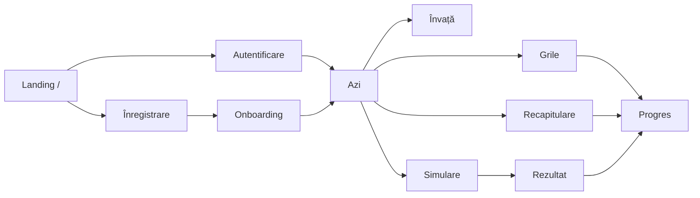

# BacBio – Structura aplicației

Oct 6, 2026 · @Mada

BacBio este o aplicație web (apoi mobil) care pregătește elevii pentru Bacalaureatul la biologie, pe programa oficială de simulare 2026, într-un format de 10–20 de minute pe zi.

## Scop și principii

Elevul țintă e în clasa a XII-a (uneori a XI-a), folosește telefonul și învață seara. Părintele plătește. Elevul folosește aplicația singur, fără profesor: explicațiile, planul zilnic și corectarea sunt în aplicație. Cele patru principii care decid structura paginilor:

1. **Învățare activă:** fiecare temă se verifică prin întrebări, nu se citește pasiv.
2. **Repetiție spațiată:** ce ai greșit revine automat în planul zilnic.
3. **Plan zilnic adaptiv:** aplicația decide ce faci azi, în funcție de data examenului și de punctele slabe.
4. **Simulare realistă:** examen complet, cronometrat, cu notă estimată (3 ore, 100 de puncte, 10 din oficiu, promovare de la 5).

## Harta aplicației

Elevul trece prin paginile publice, apoi lucrează în jurul paginii **Azi**.

Azi trimite elevul la Învață, Grile, Recapitulare sau Simulare; grilele, recapitularea și rezultatul simulării alimentează Progres.

## Conținutul: 2 variante, 38 de capitole

Elevul susține una dintre cele două variante ale programei, iar tot conținutul (capitole, grile, simulări) se grupează după ea. Materialele de conținut sunt în [`continut/`](../continut/README.md).

| Varianta                                 | Clasa     | Capitole     | Stare                                                                                  |
| ---------------------------------------- | --------- | ------------ | -------------------------------------------------------------------------------------- |
| I. Biologie vegetală și animală (E.d)    | IX și X   | 23 (A01–A23) | Complet: 623 de itemi, glosar, fișe de recuperare, tabele comparative, confuzii tipice |
| II. Anatomie, genetică și ecologie umană | XI și XII | 15 (B01–B15) | Doar harta capitolelor, din cuprinsurile manualelor; fără itemi                         |

- Harta Modulului A, cu concepte, sloturi de bac și prerechizite: [`continut/docs/harta_continut.md`](../continut/docs/harta_continut.md).
- Harta Modulului B: [`continut/docs/modul_B_harta.md`](../continut/docs/modul_B_harta.md).
- Formatul probei (Subiectele I, II, III și tipurile de itemi): [`continut/docs/format_proba.md`](../continut/docs/format_proba.md).

Date pentru dezvoltare: [`src/lib/curriculum.ts`](../src/lib/curriculum.ts) citește harta Modulului A din `continut/out/harta_continut.json`; [`src/lib/continut.ts`](../src/lib/continut.ts) expune banca de itemi și materialele de sprijin.

## Pagini publice

Cinci pagini aduc elevul în aplicație, iar onboarding-ul îl duce rapid la primul plan zilnic.

| Pagină        | Rută             | Ce conține                                                                                  | Acțiunea principală |
| ------------- | ---------------- | ------------------------------------------------------------------------------------------- | ------------------- |
| Landing       | `/`              | Promisiune, cum funcționează (3 pași), previzualizare grilă, prețuri pe scurt, întrebări frecvente | „Începe gratuit”    |
| Înregistrare  | `/inregistrare`  | Email + parolă sau Google, acord termeni, acord părinte sub 16 ani                          | Creează cont        |
| Autentificare | `/autentificare` | Email + parolă sau Google, resetare parolă                                                  | Intră în cont       |
| Onboarding    | `/onboarding`    | Varianta susținută, data examenului, minute pe zi (10/20/30), test rapid de nivel           | Generează planul    |
| Prețuri       | `/pret`          | Gratuit, Lunar, Până la Bac; plată prin Stripe                                              | Alege planul        |

## Zona elevului

Cinci secțiuni sunt în bara de navigare de jos (Azi, Învață, Grile, Simulare, Progres); Recapitulare se deschide din Azi, iar Cont din profil.

| Pagină                  | Rută                           | Ce conține                                                                    |
| ----------------------- | ------------------------------ | ----------------------------------------------------------------------------- |
| Azi                     | `/azi`                         | Countdown până la examen, seria de zile, planul zilnic, punctul slab al zilei |
| Învață                  | `/invata`                      | Alegere variantă → capitole pe clase → temele unui capitol cu întrebări de verificare |
| Capitol                 | `/invata/[varianta]/[capitol]` | Temele din programă, marcaj „am înțeles” / „repetă mai târziu”, buton către grile |
| Grile                   | `/grile`                       | Lista capitolelor, filtre (dificultate, doar greșite), mod mixt               |
| Sesiune de grile        | `/grile/[capitol]`             | O întrebare pe ecran, explicație după răspuns, „Cât de sigur ești?”, scor final |
| Recapitulare            | `/recapitulare`                | Coada de repetiție spațiată pentru azi                                        |
| Simulare                | `/simulare`                    | Lista simulărilor pe variantă, reguli, reia o simulare începută               |
| Simulare în desfășurare | `/simulare/[id]`               | Cronometru, navigare între itemi, salvare automată                            |
| Rezultat                | `/simulare/[id]/rezultat`      | Nota estimată, analiză pe capitole, revizuire item cu item                    |
| Progres                 | `/progres`                     | Nota în timp, stăpânire pe capitole, top puncte slabe                         |
| Cont                    | `/cont`                        | Profil, abonament, notificări, export/ștergere date (GDPR)                    |

## Administrare

Zona `/admin` e accesibilă doar echipei aplicației; elevii nu o văd. Validarea conținutului e un pas intern de calitate (opțional, cu ajutorul unui specialist) înainte ca întrebările să fie publicate.

- **Întrebări** (`/admin/intrebari`): tabel cu filtre (capitol, tip, dificultate, validat), formular de editare, import în masă.
- **Simulări** (`/admin/simulari`): compunere din întrebări validate, barem pentru itemii deschiși, publicare gratuită sau premium.

## Gratuit vs. premium

Propunere de pornire: elevul vede valoarea în prima sesiune, apoi întâlnește o limită clară. Limitele exacte se stabilesc împreună.

| Zonă                    | Gratuit                   | Premium                 |
| ----------------------- | ------------------------- | ----------------------- |
| Capitole și grile       | 1–2 capitole              | Toate capitolele        |
| Simulări                | 1 simulare de probă       | Toate simulările        |
| Repetiție spațiată      | Pentru capitolele gratuite | Pentru tot conținutul  |
| Plan zilnic și countdown | Da                       | Da                      |
| Progres                 | Rezumat                   | Detaliat, pe capitole   |

Planuri: **Abonament lunar** sau **Plată unică până la Bac**. Accesul se verifică pe server, nu doar în interfață.

## Întrebări deschise

- [ ] Programa de simulare nu listează conținuturi de ecologie, dar titlul Variantei II o menționează; la clasa a XII-a apare doar genetica moleculară. Există o anexă completă?
- [x] Structura subiectelor (Subiectul I, II, III): reconstituită din subiectul de bac 2025 și simularea 2026 (`continut/docs/format_proba.md`). Lipsește încă baremul oficial.
- [ ] Fișele de sinteză din care vin capitolele A01–A23 sunt din 2012. Trebuie verificate cu programa în vigoare.
- [ ] Modulul B: programa actuală și subiectele oficiale, înainte de producerea itemilor.
- [ ] Problemele heterozomale din A23 (hemofilie, daltonism) sunt extinderi: apar în programă?
- [ ] Limitele exacte ale planului gratuit și prețurile.
- [ ] Cine verifică corectitudinea întrebărilor înainte de publicare (tu, un specialist sau ambii)?

## Pașii următori

1. [x] Design vizual: tokenii de culoare (temă deschisă și întunecată), fonturile Bricolage Grotesque + Inter și ecranele principale sunt în `src/app/globals.css`, `tailwind.config.ts` și `src/components/`.
2. Schema bazei de date și importul băncii de itemi din `continut/out/`.
3. Motorul de repetiție spațiată și sesiunile de grile.
